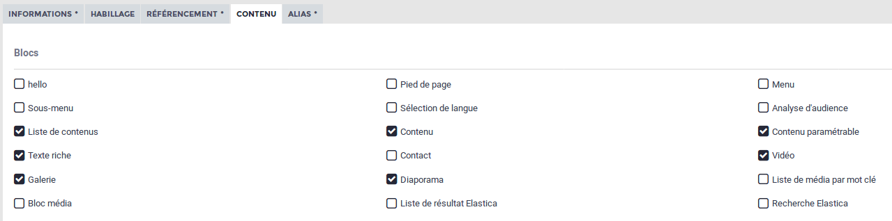
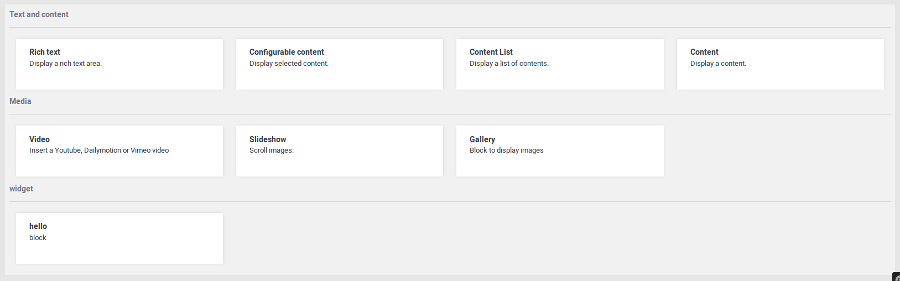
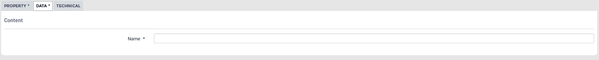
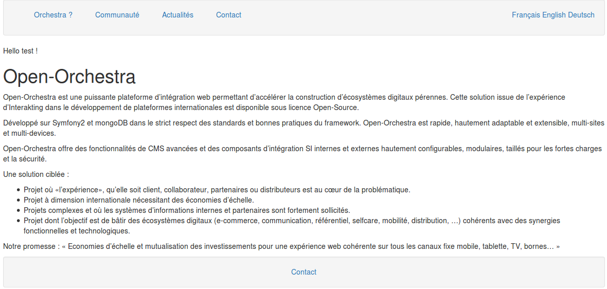
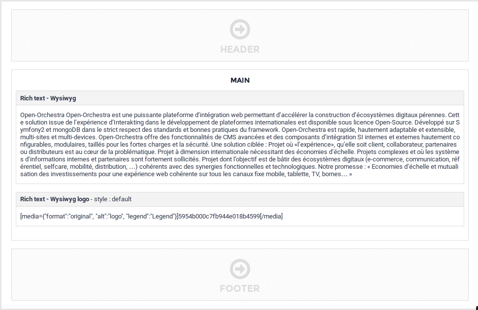
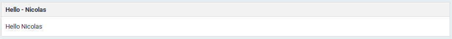

Blocs
=====

Présentation des concepts
-------------------------

Une page visualisée dans le backoffice d'OpenOrchestra présente un layout
statique comprenant des zones éditables dans lesquelles il est possible
d'ajouter des blocs (voir la documentation sur les templates des nodes).
Ces blocs nécessitent, en règle générale, un paramétrage se faisant à l'aide
d'un formulaire. Ex : un bloc remontant une liste de contenus et ayant pour
paramètres le type des contenus remontés, leur nombre... On distingue dans
OpenOrchestra deux types de blocs, les blocs partagés listés dans le menu
Configuration/Bloc Partagé qui peuvent être utilisés dans plusieurs pages et
les blocs non-partagés dont le paramétrage se fait directement au niveau de
la page qui l'embarque et sont donc spécifiques à cette page.
Dans cette documentation, nous allons donc voir comment créer un nouveau type
de bloc, son formulaire de paramétrage, son rendu en backoffice et en frontoffice,
ses éléments de configuration et sa gestion ESI.

Stratégie d'affichage frontoffice
---------------------------------

Ce paragraphe nécessite la connaissance du design pattern strategy.
Tout d'abord, une stratégie d'affichage pour le frontoffice est créée. Elle doit
étendre
``OpenOrchestra\DisplayBundle\DisplayBlock\Strategies\AbstractDisplayBlockStrategy``.
Le code qui suit crée un bloc chargé d'afficher le template ``Hello/show.html.twig``

.. code-block:: php

    // src/Acme/Bundle/FrontBundle/DisplayBlock/HelloStrategy.php

    namespace Acme\Bundle\FrontBundle\DisplayBlock;

    use  OpenOrchestra\DisplayBundle\DisplayBlock\Strategies\AbstractDisplayBlockStrategy;
    use OpenOrchestra\ModelInterface\Model\ReadBlockInterface;
    use Symfony\Component\HttpFoundation\Response;

    /**
     * Class HelloStrategy
     */
    class HelloStrategy extends AbstractDisplayBlockStrategy
    {
        // block name
        const NAME = 'hello';

        /**
         * Check if the strategy support this block
         *
         * @param ReadBlockInterface $block
         *
         * @return boolean
         */
        public function support(ReadBlockInterface $block)
        {
            return HelloStrategy::NAME == $block->getComponent();
        }

        /**
         * Indicate if the block is public or private
         *
         * @param ReadBlockInterface $block
         *
         * @return boolean
         */
        public function isPublic(ReadBlockInterface $block)
        {
            return true;
        }

        /**
         * Perform the show action for a block
         *
         * @param ReadBlockInterface $block
         *
         * @return Response
         */
        public function show(ReadBlockInterface $block)
        {
            return $this->render('AcmeFrontBundle:Block/Hello:show.html.twig', array(
                'name' => $block->getAttribute('name')
            ));
        }

        /**
         * @param ReadBlockInterface $block
         *
         * @return array
         */
        public function getCacheTags(ReadBlockInterface $block)
        {
            return array();
        }

        /**
         * Get the name of the strategy
         *
         * @return string
         */
        public function getName()
        {
            return 'hello';
        }
    }

.. code-block:: twig

    {# src/Acme/Bundle/FrontBundle/Resources/views/Block/Hello/show.html.twig #}

    

    
        Hello {{ name }} !
    

Maintentant que la stratégie est créée, il faut l'enregistrer la stratégie auprès
du ``OpenOrchestra\DisplayBundle\DisplayBlock\DisplayBlockManager`` en la définissant
comme service taggué ``open_orchestra_display.display_block.strategy``.

.. code-block:: yaml

    # src/Acme/Bundle/FrontBundle/Resources/config/services.yml

    services:
        acme_front.display_block.Hello:
            class: Acme\Bundle\FrontBundle\DisplayBlock\HelloStrategy
            tags:
                - { name: open_orchestra_display.display_block.strategy }

Stratégie de formulaire backoffice
----------------------------------

Nous allons maintenant créer le formulaire permettant de renseigner les paramètres
de notre bloc, ici ``name`` utilisé dans le template de rendu frontoffice. Il s'agit
d'une stratégie devant étendre
``OpenOrchestra\Backoffice\GenerateForm\Strategies\AbstractBlockStrategy``.

.. code-block:: php

    // src/Acme/Bundle/BackBundle/GenerateForm/HelloStrategy.php

    namespace Acme\Bundle\BackBundle\GenerateForm;

    use OpenOrchestra\Backoffice\GenerateForm\Strategies\AbstractBlockStrategy;
    use OpenOrchestra\ModelInterface\Model\BlockInterface;
    use Symfony\Component\Form\FormBuilderInterface;
    use Acme\Bundle\FrontBundle\DisplayBlock\HelloStrategy as BaseHelloStrategy;

    /**
     * Class HelloStrategy
     */
    class HelloStrategy extends AbstractBlockStrategy
    {
        /**
         * @param BlockInterface $block
         *
         * @return bool
         */
        public function support(BlockInterface $block)
        {
            return BaseHelloStrategy::NAME === $block->getComponent();
        }

        /**
         * {@inheritdoc}
         */
        public function buildForm(FormBuilderInterface $builder, array $options)
        {
            $builder->add('name', 'text', array(
                'group_id' => 'data', //onglet d'affichage dans le formulaire du bloc
                'sub_group_id' => 'content', //fieldset d'affichage dans le formulaire du bloc
            ));TinyMCEWysiwyg
        }

        /**
         * @return string
         */
        public function getName()
        {
            return 'hello';
        }
    }

Comme pour la stratégie frontoffice, nous allons enregistrer cette stratégie auprès
de son manager ``OpenOrchestra\BackofficeBundle\StrategyManager\GenerateFormManager``
en créant un service taggué ``open_orchestra_backoffice.generate_form.strategy``.

.. code-block:: yaml

    # src/Acme/Bundle/BackBundle/Resources/config/services.yml

    services:
        acme_back.generate_form.hello:
            class: Acme\Bundle\BackBundle\GenerateForm\HelloStrategy
            arguments:
                - '%open_orchestra_backoffice.block_default_configuration%'
            tags:
                - { name: open_orchestra_backoffice.generate_form.strategy }

On remarquera l'injection du paramètre ``open_orchestra_backoffice.block_default_configuration``
permettant de définir les valeurs par defaut pour les attributs maxAge et searchable du block.

Maintenant, il s'agit d'activer le block grâce à la configuration suivante :

.. code-block:: yaml

    #app/config.ymllapp/config.ym
    open_orchestra_backoffice:
        blocks:
            #liste des blocs à activer
            - hello
        block_configuration:
            #configuration du bloc
            hello:
                category: widget
                name: hello
                description: block saying hello

Dans le formulaire des sites, dans l'onglet contenu, vous devriez maintenant
pouvoir activer le bloc ``hello`` pour votre site.

Ainsi vous pouvez retrouver le bloc ``hello`` lors de l'ajout d'un bloc.

On peut vérifier la présence du formulaire pour le ``name``

Ainsi que son rendu en front

Stratégie de rendu backoffice
-----------------------------

Tout bloc backoffice bénéficie, lors de sa visualisation dans un contexte de node, d'un rendu par
défaut réalisé par ``OpenOrchestra\Backoffice\DisplayBlock\Strategies\DefaultStrategy``.

Il peut être nécessaire de personnaliser ce rendu et pour ce faire nous allons créer sa stratégie
de rendu back.

.. code-block:: php

    // src/Acme/Bundle/BackBundle/DisplayBlock/HelloStrategy.php

    namespace Acme\Bundle\BackBundle\DisplayBlock;

    use OpenOrchestra\DisplayBundle\DisplayBlock\Strategies\HelloStrategy as BaseHelloStrategy;
    use OpenOrchestra\Backoffice\DisplayBlock\Strategies\AbstractDisplayBlockStrategy;
    use OpenOrchestra\ModelInterface\Model\ReadBlockInterface;

    use Symfony\Component\HttpFoundation\Response;

    /**
     * Class HelloStrategy
     */
    class HelloStrategy extends AbstractDisplayBlockStrategy
    {
        /**
         * Check if the strategy support this block
         *
         * @param ReadBlockInterface $block
         *
         * @return boolean
         */
        public function support(ReadBlockInterface $block)
        {
            return BaseHelloStrategy::NAME == $block->getComponent();
        }

        /**
         * Perform the show action for a block
         *
         * @param ReadBlockInterface $block
         *
         * @return Response
         */
        public function show(ReadBlockInterface $block)
        {
            return $this->render(
                'AcmeBackBundle:Block/Hello:show.html.twig',
                array('htmlContent' => $this->toString($block))
            );
        }

        /**
         * @param ReadBlockInterface $block
         *
         * @return string
         */
        public function toString(ReadBlockInterface $block)
        {
            return strip_tags($block->getAttribute('name'));
        }

        /**
         * Perform the show action for a block
         *
         * @param ReadBlockInterface $block
         *
         * @return Response
         */
        public function show(ReadBlockInterface $block)
        {
            return $this->render(
                'AcmeBackBundle:Block/Hello:show.html.twig',
                array('name' => $block->getAttribute('name'))
            );
        }

        /**
         * Get the name of the strategy
         *
         * @return string
         */
        public function getName()
        {
            return 'Hello';
        }
    }

.. code-block:: twig

    {# src/Acme/Bundle/BackBundle/Resources/views/Block/Hello/show.html.twig #}

    

        Hello {{ htmlContent|raw() }}
    

Cette stratégie devra être enregistrée au prêt de
``OpenOrchestra\Backoffice\DisplayBlock\DisplayBlockManager`` grâce à la configuration YAML
suivante en la définissant comme un service taggué ``open_orchestra_backoffice.display_block.strategy``:

.. code-block:: yaml

    # src/Acme/Bundle/FrontBundle/Resources/config/services.yml

    services:
        acme_back.display.tiny_mce_wysiwyg:
            class: Acme\Bundle\BackBundle\DisplayBlock\HelloStrategy
            tags:
                - { name: open_orchestra_backoffice.display_block.strategy }

On obtient alors ce rendu :

