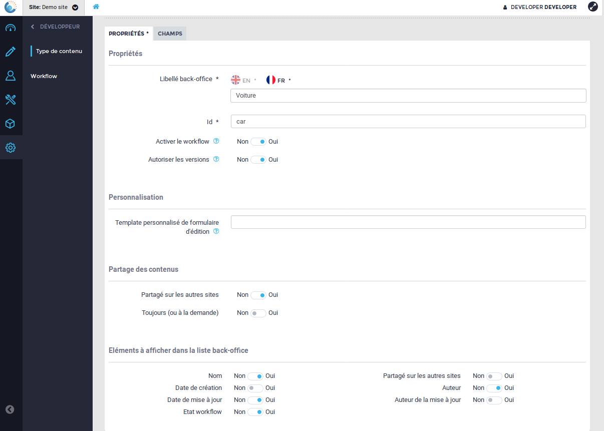
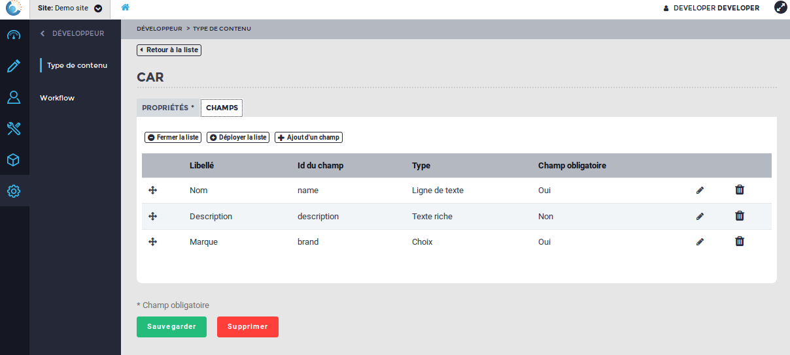
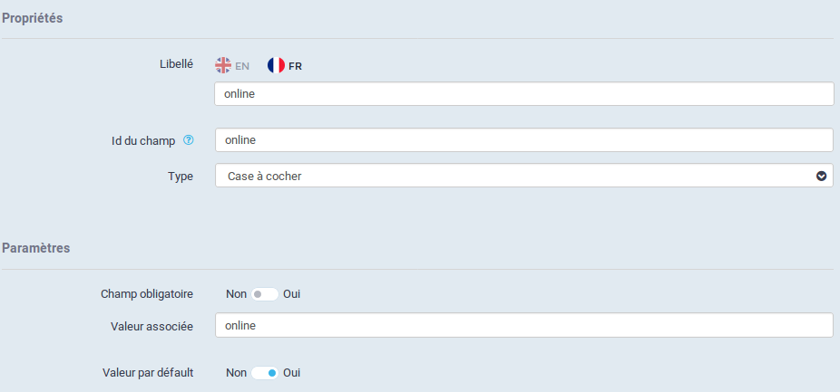
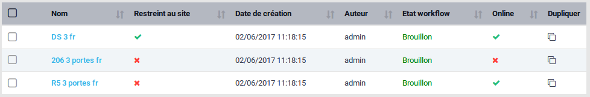
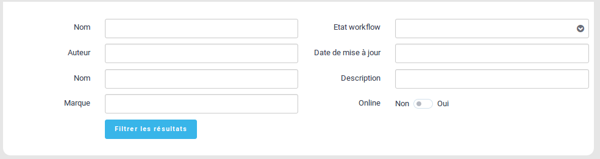

Contenu, Type de contenu et champ personnalisé
==============================================

Présentation des concepts
-------------------------

OpenOrchestra prend en charge un certain nombre de fonctionnalités communes à la
gestion de contenus : processus de validation, versions, suppression réversible,
droits d'accès, intégrité... Un soin tout particulier doit donc être apporté lors
de la modélisation technique d'un projet afin d'optimiser cette prise en charge et
donc l'utilisation d'OpenOrchestra. Cette notion de contenu peut et doit dépasser
la notion habituelle de contenu éditorial. La possibilité de déconnecter les
fonctionnalités de processus de validation et de versions permet d'utiliser ces
contenus comme des données de référence, pour une liste de départements par exemple.

La description d'un contenu est portée par l'objet type de contenu. Celui-ci bénéficie
également d'un certain nombre de fonctionnalités natives : processus de validation,
versions, suppression réversible, droits d'accès... Il est chargé de décrire les différents
champs permettant la contribution des contenus héritant de cet objet. Par exemple, le type
de contenu voiture spécifiera que les contenus en dérivant sont constitués d'un nom, champ
de type texte, d'une description, champ de type tinyMce, d'une marque, champ de type
sélecteur... Ci-dessous, les écrans du backoffice correspondant à la création de ce type de
contenu.

OpenOrchestra vient avec un certain nombre de types de champs pré-définis :
- Choix (champ select avec liste des options à renseigner)
- Choix d'un contenu (champ select avec une liste filtrée de contenus)
- Date (champ date avec calendrier ou trois champs texte numériques ...)
- Adresse email (champ texte avec vérification du formatage email)
- Champ caché
- Entier (champ texte numérique)
- Monnaie (champ texte numérique avec 2 décimales)
- Ligne de texte (champ de type texte)
- Zone de texte (champ de type textarea)
- Texte riche (tinyMce)
- Média (champ permettant de sélectionner un élément de la médiathèque)

L'une des tâches récurrentes pour l'intégrateur sera d'ajouter à cette liste de
nouveaux types de champ en fonction des spécificités de son projet.

Ajout d'un type de champ
------------------------

Voici le détail pour ajouter un type de champ case à cocher à notre précédent exemple pour
pouvoir spécifier si une voiture est en ligne ou non.

.. code-block:: yaml

    #app/config.yml
    open_orchestra_backoffice:
        field_types:
            online_checkbox:
                # le label utilisé dans le sélecteur de type dans le type de contenu
                label: Case à cocher
                # le FormType utilisé dans le formulaire du contenu (namespace ou alias)
                type: Symfony\Component\Form\Extension\Core\Type\CheckboxType
                # le type du format de désérialisation (voir JMS\Serializer\GraphNavigator)
                deserialize_type: string
                # la stratégie de recherche dans le tableau des contenus
                search: online_checkbox
                options:
                    required:
                        # la valeur par défaut de l'option
                        default_value: false
                    value:
                        # la valeur par défaut de l'option
                        default_value: online
                default_value:
                    # le FormType utilisé pour contribuer la valeur par défaut du champ
                    type: Symfony\Component\Form\Extension\Core\Type\CheckboxType
                    options:
                        # le label utilisé pour la valeur par défaut
                        label: Valeur par défault
                        # l'option obligatoire ou non pour la valeur par défaut
                        required: false
        options:
            value:
                # le FormType utilisé pour contribuer la valeur de l'option
                type: Symfony\Component\Form\Extension\Core\Type\TextType
                # le label de l'option
                label: Valeur associée
                # le caractère obligatoire ou non de cette option
                required: true

On obtient ainsi dans le formulaire de type de contenu :

Et dans le formulaire d'un contenu voiture :

On remarque dans l'exemple la définition d'une nouvelle option "value" contribuée à l'aide
d'un TextType, ayant pour valeur par défault "online" et qui sera passer à l'OptionResolver
de notre checkbox. OpenOrchestra vient avec un certain nombre d'options pré-définies :

- max_length
- required
- grouping
- rounding_mode
- multiple
- expanded
- choices
- currency
- precision
- format
- widget
- input
- content_search (pour ``OpenOrchestra\Backoffice\Form\Type\Component\ContentChoiceType``)

Tableau de consultation
-----------------------

Lors de la visualisation de ces contenus sous formes de tableau, il est nécessaire de mettre en
place la brique permettant de transformer les différentes propriétés du contenu sous forme
de chaîne de caractères. Cela se fait par la mise en place d'une stratégie de transformation de
la propriété implémentant l'interface
``OpenOrchestra\Backoffice\ValueTransformer\ValueTransformerInterface`` et gérée par
``OpenOrchestra\Backoffice\ValueTransformer\ValueTransformerManager``. L'inscription se fait
automatiquement lors de la passe de compilation en définissant la stratégie comme un service taggué
``open_orchestra_backoffice.value_transformer.strategy``. Cette représentation de la propriété sous
forme de chaîne est générée à la création ou à la modification du contenu et pas à la volée lors
de sa consultation.

Voici le code du transformer :

.. code-block:: php

    // src/AcmeBundle/ValueTransformer/OnlineCheckboxToHtmlStringTransformer.php
    namespace AcmeBundle\ValueTransformer\Strategies;

    use OpenOrchestra\Backoffice\ValueTransformer\ValueTransformerInterface;

    /**
     * Class OnlineCheckboxToHtmlStringTransformer
     */
    class OnlineCheckboxToHtmlStringTransformer implements ValueTransformerInterface
    {
        /**
         * @param array $data
         *
         * @return string
         */
        public function transform($data)
        {
            return ($data) ?
                '<i aria-hidden="true" class="fa fa-check text-success"></i>' :
                '<i aria-hidden="true" class="fa fa-close text-danger"></i>';
        }

        /**
         * @param string $fieldType
         * @param mixed  $value
         *
         * @return bool
         */
        public function support($fieldType, $value)
        {
            return gettype($value) == 'boolean' && ($fieldType == 'online_checkbox');
        }

        /**
         * @return string
         */
        public function getName()
        {
            return 'online_checkbox';
        }
    }

et le paramétrage permettant de l'activer :

.. code-block:: yaml

    # app/config/services.yml
    services:
        acme_bundle.value_transformer.online_checkbox:
            class: AcmeBundle\ValueTransformer\Strategies\OnlineCheckboxToHtmlStringTransformer
            tags:
                - { name: open_orchestra_backoffice.value_transformer.strategy }

On obtient ainsi la liste de consultation suivante :

Moteur de filtres
-----------------

Dans le YAML permettant d'ajouter le type de champ case à cocher,
le paramètre ``open_orchestra_backoffice.field_types.online_checkbox.search``
sert à gérer entre autres l'affichage dans le moteur de filtres.
La première étape est de créer la classe js permettant de générer l'affichage.

.. code-block:: js

    // src/AcmeBundle/Ressources/public/ecmascript/Acme/Service/SearchFormGroup/OnlineCheckboxForm.js
    import TemplateManager         from '../../../../OpenOrchestra/Service/TemplateManager'
    import AbstractSearchFormGroup from '../../../../OpenOrchestra/Service/SearchFormGroup/AbstractSearchFormGroup'

    /**
     * @class OnlineCheckboxForm
     */
    class OnlineCheckboxForm extends AbstractSearchFormGroup
    {
        /**
         * test if field is supported
         *
         * @param {Object} field
         */
        support(field) {
            // check on the value setted in the yml
            return field.search == 'online_checkbox';
        }

        /**
         * render the field
         *
         * @param {Object} field
         */
        render(field) {
            return TemplateManager.get('SearchFormGroup/onlineCheckboxForm')({
                field: field
            });
        }
    }

    // unique instance of OnlineCheckboxForm
    export default (new OnlineCheckboxForm);

Ensuite il faut enregistrer cette classe auprès du manager responsable de son
exploitation (pour plus de détail, voir la partie front js).

.. code-block:: js

    // src/AcmeBundle/Ressources/public/ecmascript/Acme/Application/AcmeSubApplication.js
    import SearchFormGroupManager  from '../../../../OpenOrchestra/Service/SearchFormGroup/Manager'
    import CheckboxSearchFormGroup from '../../../../OpenOrchestra/Service/SearchFormGroup/OnlineCheckboxForm'

    /**
     * @class AcmeSubApplication
     */
    class AcmeSubApplication
    {
        /**
         * Run sub Application
         */
        run() {
            this._initSearchFormGroupManager;
        }

        /**
         * Initialize field search library
         * @private
         */
        _initSearchFormGroupManager() {
            SearchFormGroupManager.add(CheckboxSearchFormGroup);
        }
    }

Puis il faut créer le template d'affichage SearchFormGroup/onlineCheckboxForm.

.. code-block:: html

    <!-- src/AcmeBundle/Ressources/public/template/SearchFormGroup/onlineCheckboxForm._tpl.html -->
    <label for="attributes.online" class="control-label col-md-4">
        Online
    </label>
    

        Non
        <label class="switch">
            <input id="attributes.online" name="attributes.online" value="1" type="checkbox">
            

        </label>
        Oui
    

On obtient le moteur de recherche suivant.

Requête de filtres
------------------

Enfin, les données du moteur de recherche vont être, à la soumission,
envoyées à l'API pour retourner les contenus correspondants. L'API va
donc créer la requête permettant de filtrer les contenus. Cela se fait
au niveau de la requête de repository
findForPaginateFilterByContentTypeSiteAndLanguage de votre ContentRepository.

.. note::

    Si vous utilisez les bundle mongo, alors une mécanique a été mise en
    place pour pouvoir enrichir facilement la recherche.

Création du trait de filtrage :

.. code-block:: php

    // src/AcmeBundle/Pagination/MongoTrait/FilterTypeStrategy/Strategies/OnlineCheckboxFilterStrategy.php
    namespace AcmeBundle\Pagination\MongoTrait\FilterTypeStrategy\Strategies;

    use OpenOrchestra\Pagination\FilterType\FilterTypeInterface;

    /**
     * Class OnlineCheckboxFilterStrategy
     */
    class OnlineCheckboxFilterStrategy implements FilterTypeInterface
    {
        const FILTER_TYPE =  'online_checkbox';

        /**
         * @param string $type
         *
         * @return bool
         */
        public function support($type)
        {
            return $type === self::FILTER_TYPE;
        }

        /**
         * @param string $name
         * @param string $value
         * @param string $documentName
         * @param string $format
         *
         * @return array
         */
        public function generateFilter($name, $value, $documentName='', $format='')
        {
            if ($value === 'true' || $value === '1') {
                return array($name => true);
            } elseif ($value === 'false' || $value === '0') {
                return array($name => false);
            }

            return null;
        }

        /**
         * @return string
         */
        public function getName()
        {
            return 'online_checkbox_filter';
        }
    }

Enregistrement du trait auprès du manager qui construit la requête
dans le repository à l'aide d'un service taggué.

.. code-block:: yaml

    # app/config/services.yml
    services:
        acme_bundle.value_transformer.online_checkbox:
            class: AcmeBundle\Pagination\MongoTrait\FilterTypeStrategy\Strategies\OnlineCheckboxFilterStrategy
            tags:
                - { name: open_orchestra_pagination.filter_type.strategy }
