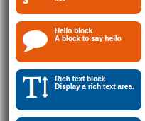
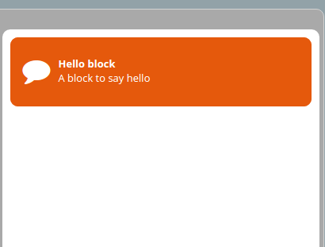
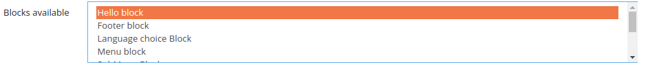

How to Create a Block
=====================

In Open Orchestra, pages are made of blocks representing data to display.

The Block creation `section`_ covers the strategies needed to a block.

This cookbook article covers the created of block call ``Hello``.

Front Office display strategy
~~~~~~~~~~~~~~~~~~~~~~~~~~~~~

First, must be created the block display strategy of Front Office in ``FrontBundle``.
In our case the strategy is very simple, it returns only rendering
the template twig ``Hello:show.html.twig`` with a parameter name.
The name parameter is a parameter of the block that can be contributed
in the Back Office as we shall see later.

The strategy must extend the class ``OpenOrchestra\DisplayBundle\DisplayBlock\Strategies\AbstractStrategy``.

.. code-block:: php

    // src/Acme/Bundle/FrontBundle/DisplayBlock/HelloStrategy.php

    namespace Acme\Bundle\FrontBundle\DisplayBlock;

    use OpenOrchestra\DisplayBundle\DisplayBlock\Strategies\AbstractStrategy;
    use OpenOrchestra\ModelInterface\Model\ReadBlockInterface;
    use Symfony\Component\HttpFoundation\Response;

    /**
     * Class HelloStrategy
     */
    class HelloStrategy extends AbstractStrategy
    {
        // block name
        const NAME = 'hello';

        /**
         * Check if the strategy support this block
         *
         * @param ReadBlockInterface $block
         *
         * @return boolean
         */
        public function support(ReadBlockInterface $block)
        {
            return HelloStrategy::NAME == $block->getComponent();
        }

        /**
         * Perform the show action for a block
         *
         * @param ReadBlockInterface $block
         *
         * @return Response
         */
        public function show(ReadBlockInterface $block)
        {
            return $this->render('AcmeFrontBundle:Block/Hello:show.html.twig', array(
                'name' => $block->getAttribute('name')
            ));
        }

        /**
         * @param ReadBlockInterface $block
         *
         * @return array
         */
        public function getCacheTags(ReadBlockInterface $block)
        {
            return array();
        }

        /**
         * Get the name of the strategy
         *
         * @return string
         */
        public function getName()
        {
            return 'hello';
        }
    }

.. code-block:: twig

    {# src/Acme/Bundle/FrontBundle/Resources/views/Block/Hello/show.html.twig #}

    

    
        Hello {{ name }} !
    

Once our template and our strategy created, it is necessary to register strategy as a service tagged by
``open_orchestra_display.display_block.strategy`` for it to be found by the system.

.. code-block:: yaml

    # src/Acme/Bundle/FrontBundle/Resources/config/services.yml

    services:

        # ...

        acme_front.display_block.Hello:
            class: Acme\Bundle\FrontBundle\DisplayBlock\HelloStrategy
            tags:
                - { name: open_orchestra_display.display_block.strategy }

Back Office form strategy
~~~~~~~~~~~~~~~~~~~~~~~~~
As presented above, the block has a configurable parameter ``name``.
It is necessary to create the form strategy that add the input to contribute the name.

For it, it must created a class which extend ``OpenOrchestra\Backoffice\GenerateForm\Strategies\AbstractBlockStrategy``
and added the necessary field as we would for a `form`_.

By default a block has already fields ``label``,  ``class``, ``id`` and ``maxAge``.

.. code-block:: php

    // src/Acme/Bundle/BackBundle/GenerateForm/HelloStrategy.php

    namespace Acme\Bundle\BackBundle\GenerateForm;

    use OpenOrchestra\Backoffice\GenerateForm\Strategies\AbstractBlockStrategy;
    use OpenOrchestra\ModelInterface\Model\BlockInterface;
    use Symfony\Component\Form\FormBuilderInterface;
    use Acme\Bundle\FrontBundle\DisplayBlock\HelloStrategy as BaseHelloStrategy;

    /**
     * Class HelloStrategy
     */
    class HelloStrategy extends AbstractBlockStrategy
    {
        /**
         * @param BlockInterface $block
         *
         * @return bool
         */
        public function support(BlockInterface $block)
        {
            return BaseHelloStrategy::NAME === $block->getComponent();
        }

        /**
         * {@inheritdoc}
         */
        public function buildForm(FormBuilderInterface $builder, array $options)
        {
            $builder->add('name', 'text');
        }

        /**
         * @return string
         */
        public function getName()
        {
            return 'hello';
        }
    }

Like for display strategy, it is necessary to register this strategy as a service
but this time with the tag ``open_orchestra_backoffice.generate_form.strategy``.

.. code-block:: yaml

    # src/Acme/Bundle/BackBundle/Resources/config/services.yml

    services:

        # ...

        acme_back.generate_form.hello:
            class: Acme\Bundle\BackBundle\GenerateForm\HelloStrategy
            tags:
                - { name: open_orchestra_backoffice.generate_form.strategy }

Back Office display strategies icon
~~~~~~~~~~~~~~~~~~~~~~~~~~~~~~~~~~~

Now, We must create the strategy that displays the icon and title block in the block menu available at node contribution.

.. image:: ../../images/block_panel.png

It must created a class which extend ``OpenOrchestra\Backoffice\DisplayIcon\Strategies\AbstractStrategy``
which return the render of twig template ``showIcon.html.twig``.

.. code-block:: php

    // src/Acme/Bundle/BackBundle/DisplayBlock/HelloStrategy.php

    namespace OpenOrchestra\ElasticaAdmin\DisplayIcon;

    use OpenOrchestra\Backoffice\DisplayIcon\Strategies\AbstractStrategy;
    use Acme\Bundle\FrontBundle\DisplayBlock\HelloStrategy as BaseHelloStrategy;

    /**
     * Class HelloStrategy
     */
    class HelloStrategy extends AbstractStrategy
    {
        /**
         * Check if the strategy support this block
         *
         * @param string $block
         *
         * @return boolean
         */
        public function support($block)
        {
            return BaseHelloStrategy::NAME === $block;
        }

        /**
         * Perform the show action for a block
         *
         * @return string
         */
        public function show()
        {
            return $this->render('AcmeBackBundle:Block/Hello:showIcon.html.twig');
        }

        /**
         * Get the name of the strategy
         *
         * @return string
         */
        public function getName()
        {
            return 'hello';
        }
    }

.. code-block:: twig

    {#  src/Acme/Bundle/BackBundle/Resources/views/Block/Hello/showIcon.html.twig #}

    

        <i class="fa fa-comment block-icon"></i>
        

            <strong>Hello block</strong>
            A block to say hello
        

    

.. code-block:: yaml

    # src/Acme/Bundle/BackBundle/Resources/config/services.yml

    services:

        # ...

        acme_back.display_icon.hello:
            class: Acme\Bundle\BackBundle\DisplayIcon\HelloStrategy
            tags:
                - { name: open_orchestra_backoffice.display_icon.strategy }

Here is an overview of rendering of block in the list:

Back Office display strategies
~~~~~~~~~~~~~~~~~~~~~~~~~~~~~~

Finally, we must create the strategy that provides rendering the block when it is contributed in a node.

As with the other strategies,  we create a class that rendering a template twig. That class should extend
``OpenOrchestra\DisplayBundle\DisplayBlock\Strategies\AbstractStrategy``.

.. code-block:: php

    // src/Acme/Bundle/BackBundle/DisplayBlock/HelloStrategy.php

    namespace Acme\Bundle\BackBundle\DisplayBlock;

    use OpenOrchestra\DisplayBundle\DisplayBlock\Strategies\AbstractStrategy;
    use OpenOrchestra\ModelInterface\Model\ReadBlockInterface;
    use Symfony\Component\HttpFoundation\Response;
    use Acme\Bundle\FrontBundle\DisplayBlock\HelloStrategy as BaseHelloStrategy;

    /**
     * Class HelloStrategy
     */
    class HelloStrategy extends AbstractStrategy
    {
        /**
         * Check if the strategy support this block
         *
         * @param ReadBlockInterface $block
         *
         * @return boolean
         */
        public function support(ReadBlockInterface $block)
        {
            return BaseHelloStrategy::NAME == $block->getComponent();
        }

        /**
         * Perform the show action for a block
         *
         * @param ReadBlockInterface $block
         *
         * @return Response
         */
        public function show(ReadBlockInterface $block)
        {
            return $this->render('AcmeBackBundle:Block/Hello:show.html.twig', array(
                'id' => $block->getId(),
                'class' => $block->getClass(),
            ));
        }

        /**
         * @param ReadBlockInterface $block
         *
         * @return array
         */
        public function getCacheTags(ReadBlockInterface $block)
        {
            return array();
        }

        /**
         * Get the name of the strategy
         *
         * @return string
         */
        public function getName()
        {
            return 'hello';
        }
    }

.. code-block:: twig

    {# src/Acme/Bundle/BackBundle/Resources/views/Block/Hello/show.html.twig #}

    {{ display_icon('hello') }}

    

        id : <i>{{ id }}</i> 
        class : <i>{{ class }}</i>
    

.. code-block:: yaml

    # src/Acme/Bundle/BackBundle/Resources/config/services.yml

    services:

        # ...

        acme_back.display_block.hello:
            class: Acme\Bundle\BackBundle\DisplayBlock\HelloStrategy
            tags:
                - { name: open_orchestra_backoffice.display_block.strategy }

Once the block has added to a node, you get the rendering below:

The block title is a translation key created automatically as follows
``open_orchestra_backoffice.block.BLOCK_NAME``.
So you have to add this key in the translation files

.. code-block:: yaml

    # src/Acme/Bundle/BackBundle/Resources/translations/messages.en.yml

    open_orchestra_backoffice:
        block:
            hello:
                title: Hello block

Add block in configuration
~~~~~~~~~~~~~~~~~~~~~~~~~~

For Open Orchestra knows the block, it must be added to the configuration.

.. code-block:: yaml

    # app/config/config.yml

    # ...

    open_orchestra_backoffice:
        blocks:
            - hello

Your block is now available in the block list when you edit your website.

.. _section: en/developer_guide/block_creation.rst
.. _form: http://symfony.com/doc/current/book/forms.html
