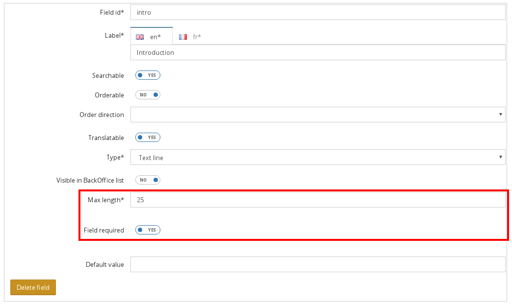
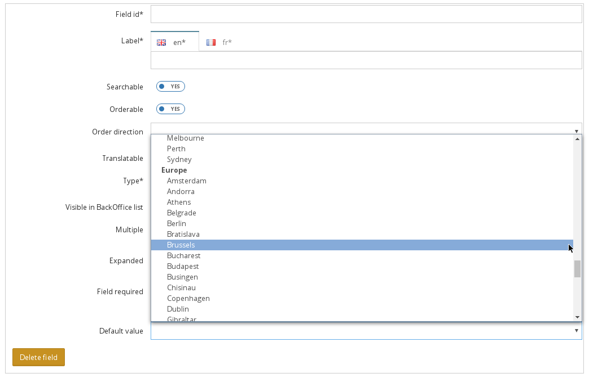
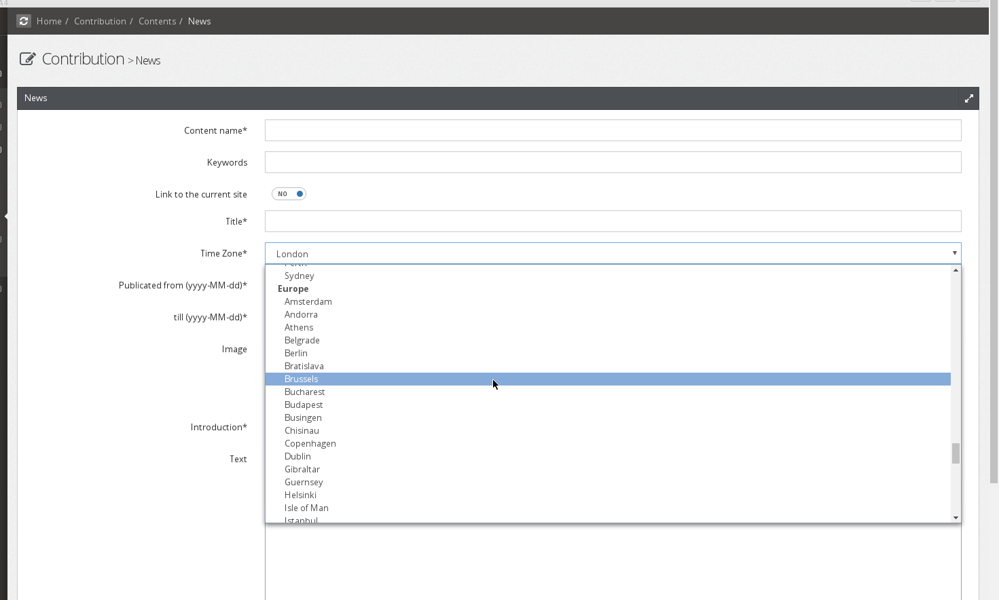

HOW TO ADD A NEW CUSTOM FIELD TO THE CONTENT TYPE FIELDS LIST
=============================================================

When an administrator create a new content type, he can describe each attribute composing the content type via
a list of available field types.

.. image:: ../../images/fieldType.png

These fields involve the form type used to render the attribute in the content. The list presents "out of the
box" several standard fields, and can be extended by a developer. This cookbook shows how to do this with a
simple example: how to add a time zone type field.

To understand this cookbook, you need to make the difference between a content and a content type. The content
type is the mold from which the contents are created. This is exactly the same relation between a class and an
object.

Principle
---------

Each content type attribute is mapped with a Symfony form type, used to render it in the related content form.
For example, the content type "News" has an attribute named "Title" described as a text line. When creating a
new "News" content, the "Title" is rendered as a text form type. To add a new attribute type to the list of
available fields, this relation must be described in the configuration.

Furthermore, an attribute should be tweaked by the administrator depending on the context where it is used.
For instance, in the context of the title of a news, the administrator would make the text line field mandatory
with a limit of 25 characters, but in the context of a short description of an item, the text line should be
optional and without limit. This functionnality is also described in the configuration.

.. image:: ../../images/text_line_field.png

Creating a new field type
-------------------------

To add a time zone field, let's start editing the config.yml to declare the Symfony form type used to contribute
a time zone:

.. code-block:: yaml

    # app/config/config.yml
    open_orchestra_backoffice:
        field_types:
            timezone_field: # A unique key naming the field
                label: open_orchestra.form.field_type.timezone # The label of the field in the list
                type: timezone # The Symfony form type used when editing a content

With this, a new entry is added to the list of available fields type.

.. image:: ../../images/timezone_selection.png

Note 1: a good practice is to set a translation key as a label rather than a raw text string.

Note 2: the term "Symfony form type" does not refer exclusively to Symfony native form types. It also
includes custom form type that you may have developed.

Creating new options
--------------------

Depending on the context, the time zone field should be rendered in different ways. For instance, maybe a
content type should require a simple selection, when another require a multiple selection. Only the site
administrator has this information, so he should have the option of setting the rendering mode when adding the
time zone field to a content type. In the same way depending on the content type, the appropriate rendering
could be either a select or a set of checkbox.

Here is the example of the text line field, allowing the administrator to set a max length and to choose if
the type is required.

Before configuring the options available for the time zone field (mandatory or not, single or multiple selection,
display mode), these options must be created. Actually, this corresponds to the options that will be passed to
the Symfony form type used to contribute the attribute. As these options can be used by other form type, they
are configured in a separate entry: ``open_orchestra_backoffice.options``

As a field option allows an administrator to choose between several available modes, configuring an option is
again a matter of mapping a Symfony form type to render it in the content type form.

This time the three options required for the time zone field (required, multiple and expanded) are already
described in the basic configuration of Open Orchestra: 

.. code-block:: yaml

    # open-orchestra-cms-bundle/BackOfficeBundle/Resources/config/validation/field_type.yml
    open_orchestra_backoffice.options:
        required:
            type: checkbox
            label: open_orchestra_backoffice.form.orchestra_fields.required_field
            required: false
        multiple:
            type: checkbox
            label: open_orchestra_backoffice.form.orchestra_fields.multiple
            required: false
        expanded:
            type: checkbox
            label: open_orchestra_backoffice.form.orchestra_fields.expanded
            required: false

According to this configuration, the three options are rendered to the administrator as checkbox, allowing him
to activate or not the feature for the content type being edited.

Note: the configuration entry named "required" make the option mandatory when adding it to a content type. But
in our example, it would lead to a non sense to have the checkboxes required.

Open Orchestra provides several other options you can use, but if your field requires a not yet created option,
you can describe it the same way.

Adding options to the Timezone field type
-----------------------------------------

Now the options are availables, we can add them to the Timezone description:

.. code-block:: yaml

    # app/config/config.yml
    open_orchestra_backoffice:
        field_types:
            timezone_field:
                label: open_orchestra.form.field_type.timezone
                type: timezone
                options:
                    multiple: # Add a multiple option with a default value: false (= single selection)
                        default_value: false
                    expanded: # Add an expanded option with a default value: false (= rendered as a select) 
                        default_value: false
                    required: # Add a required option with a default value: true (The time zone will be required in the content form)
                        default_value: true

Now when an administrator includes a time zone field in a content type, he has the opportunity to decide if in
this context the selection is single or multiple, if the time zone should be rendered as buttons or a select
and whether it is mandatory or not. By default, the time zone is set to allow only a single selection in a
select box. The selection of a zone is also mandatory. But the administrator can change this behavior by
altering the values ​​of the options in the content form.

.. image:: ../../images/timezone_options.png

Configuring the default values
------------------------------

To further increase the possibilities of contribution, it may be interesting to give the administrator the
ability to provide a default time zone in this field depending on the context of the content type. For example,
perhaps in the case of a British platform, the time zone should be preset to "Europe/London". As always, to
allow the administrator to enter a default value, we should describe which Symfony form type is to use to
contribute it.

.. code-block:: yaml

    # app/config/config.yml
    open_orchestra_backoffice:
        field_types:
            timezone_field:
                label: open_orchestra.form.field_type.timezone
                type: timezone
                default_value:
                    type: timezone # The default value is set via a timezone form type
                    options: # The default value form type require some options
                        label: open_orchestra_backoffice.form.field_type.default_value
                        required: false # The administrator does not have to set default value if he don't want one
                options:
                    multiple:
                        default_value: false
                    expanded:
                        default_value: false
                    required:
                        default_value: true

The addition of the ``default_value`` entry includes a new field to configure the time zone. This default value
is rendered as a timezone form type allowing the administrator to choose a time zone used as a default value
in the content form. The default value field will receive the options ``label`` and ``required``. On the same
way, other valid form type options may be included.

You should now be able to see the new options:

Editing a content using a Timezone field
----------------------------------------

Finally when a contributor edit a content including a time zone he see it the way the adminsitrator configured
it:

