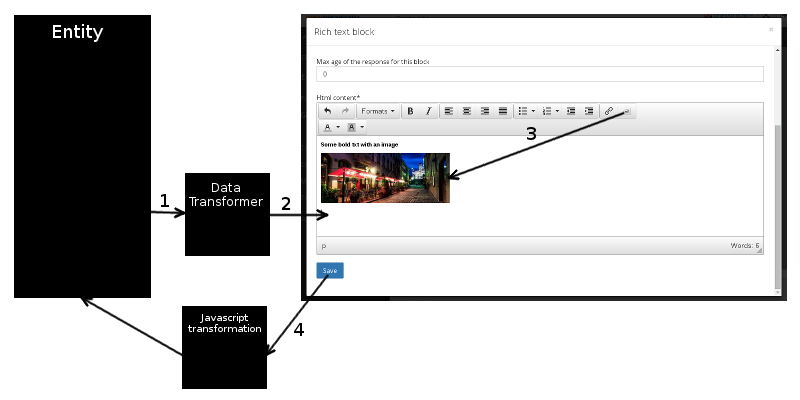

BBCode extension
================

In the Back Office, a Wysiwyg editor is used on several places where a rich text can be contributed.
You can encounter it for instance on certain blocks or Content Types. Although most of the
information entered in the editor is stored in the database in html format, you can also extend the
possibilities by introducing custom BBCode tags. This is partially done via the Open Orchestra
BBCode parser.

It's important to note that by default, not all tags are enabled in BBCode format, only those you
want to declare. For instance, putting a text in bold in the rich text editor does not produce by
default a ``[b]`` tag. Out of the box, there is only one BBCode tag: ``media``. But it is possible
to add your own tags.

In this documentation you will see how the BBCode feature fits in the main processes and how to create
a new BBCode tag in your bundle.

Wysiwyg process
---------------
Open Orchestra uses TinyMce to render a rich text input. Normally, TinyMce generates html tags, but
Open Orchestra has enhanced it to use BBCode. Here is the workflow triggered when editing an object
using a form containing rich text fields:

1. Each rich text field goes into a data transformer to interpret the BBCode tags. This data
   transformer calls the Open Orchestra BBCode parser to detect and transform valid BBCode tags into
   html tags.
2. The resulting html is given to the TinyMce editor which treats it with its standard logic.
3. When the user clicks in the toolbar to inject a BBCode tag (for instance by selecting a media),
   TinyMce inject the html representation of the BBCode, to be able to visually render the tag. For
   instance in the media case, you will see it in the editor.
4. When the user saves the form, TinyMce replaces via javascript the html tags by their BBCode
   representations.

How to create a new BBCode and add it to the parser
---------------------------------------------------
Open Orchestra provides a simple ways of adding your own custom BBCode tags, depending on their
nature. Two kind of tags exists:

- Simple tags are just text replacements. For instance a ``[b]Some Text[/b]`` should be replaced by
``<b>Some Text</b>``

- Complex tags require more than a simple regexp conversion. For instance the tag
``[media=format]MediaId[/media]`` requires to fetch the media in the database, to detect its type
and then to to return the corresponding html tag.

To add a new BBCode tag to the parser, you need to create its definition. There are two ways of
adding a definition. To create a simple tag you can quickly set a configuration. But if you prefer,
or if your tag requires a php analysis, you can use a Symfony service.

Create a simple BBCode tag via configuration
~~~~~~~~~~~~~~~~~~~~~~~~~~~~~~~~~~~~~~~~~~~~
To create a simple BBCode definition, its possible to use a trivial configuration. The parameter
``open_orchestra_bbcode.code_definitions`` contains an array of declared simple tags. Here is the
declaration of the bold tag:

.. code-block:: yaml

    bold:
        tag: b
        html: <strong>{param}</strong>

- The key ``bold`` is the name of the definition used internally by the parser.

- The ``html`` key is the html pattern of the code. The string ``{param}`` will be replaced by the
content of the BBcode tag.

- The ``tag`` key is the label used in the BBCode tag. In this example, with the ``tag`` key set to
``b``, the BBCode tag is ``[b]{param}[/b]``.

Simple tags can also include some options. For instance the tag ``[h]`` which matches a ``<h*>``
html tag requires an option to indicate the level of the header. For instance ``[h=1]Some text[/h]``
will produce a ``<h1>`` html tag. You still can declare this in a configuration file like this:

.. code-block:: yaml

        title:
            tag: h
            html: <h{option}>{param}</h{option}>
            parameters:
                use_option: true

To declare that a tag uses option, you must add the key ``parameters.use_option`` and set it to true.
Note that when declaring a tag with option, that option becomes mandatory. So if the option is not
mandatory, you should declare two versions of the tag: one with option and one without. That way
the parser will use one or the other according to the presence of an option. The ``html`` key uses
both {param} and {option} string to indicate where to place those informations.
The resulting BBCode will be ``[h={option}]{param}[/h]``

Create a BBCode tag via a service
~~~~~~~~~~~~~~~~~~~~~~~~~~~~~~~~~
BBCode definitions can also be declared by services. A service tagged with
``open_orchestra_bbcode.code_definitions`` will be recognized as introducing new definitions. Such
a service includes a BBCode definition collection and serves it via the method ``getDefinitions``.
So you are free to code your own service, but it must implement
``OpenOrchestra\BBcodeBundle\Definition\BBcodeDefinitionCollectionInterface``.

The definition collection must be composed of formatted elements implementing
``OpenOrchestra\BBcodeBundle\Definition\BBcodeDefinitionInterface``. If your definition is a simple
regex replacement, as the one seen in the previous section, you can use an Open Orchestra definition
factory. But to create a BBCode tag with a more complex logic, you will have to create your own
definition class. Both ways are explained in the next sections.

Create simple definitions with the definition factory
*****************************************************
You can quickly generate simple definitions using the OpenOrchestra\BBcodeBundle\Definition\BBcodeDefinitionFactory.
This factory can be accessed via the service named ``open_orchestra_bbcode.definition.factory``

To generate a new simple definition with this factory, call the method ``create`` with the following
parameters:

- ``$tag``: the BBCode tag, ie ``b`` for the tag [b]

- ``$html``: the html representation of the tag, ie ``<strong>{param}</strong>`` for the [b]tag

- ``$use_option``: whether the tag uses option or not

So to create a bold tag definition object, you can write:

.. code-block:: php

    $definition = $container->get('open_orchestra_bbcode.definition.factory')
        ->create('b', '<strong>{param}</strong>');

And to create a header tag definition:

.. code-block:: php

    $definition = $container->get('open_orchestra_bbcode.definition.factory')
        ->create('h', '<h{option}>{param}</h{option}>', true);

As mentionned before, to let Open Orchestra know your new definition, you have to add it to a
definition collection class implementing
``OpenOrchestra\BBcodeBundle\Definition\BBcodeDefinitionCollectionInterface``. Then make that
collection a Symfony service tagged with ``open_orchestra_bbcode.code_definitions``.

Create complex definitions with a custom class
**********************************************
If the tag you want to create requires a more complex rendering, for instance a ``youtube`` tag
searching in its parameter for a valid youtube id, you have to create your own definition class.
This definition class must implement
``OpenOrchestra\BBcodeBundle\Definition\BBcodeDefinitionInterface``. The getHtml method receives a
BBcodeElementNode representing the BBCode tag and returns the matching html version of the tag. So
it is the location to inject the specific rendering logic of your tag.

Instead of creating a full class from scratch, you can also extend the class
``OpenOrchestra\BBcodeBundle\Definition\BBcodeDefinition`` and override the getHtml method.

Here is what could look like the getHtml method for the ``youtube`` tag:

.. code-block:: php

    public function getHtml(BBcodeElementNode $el)
    {
        $content = '';
        foreach ($el->getChildren() as $child) {
            $content .= $child->getAsBBCode();
        }
        $foundMatch = preg_match('/v=([A-z0-9=\-]+?)(&.*)?$/i', $content, $matches);
        if (!$foundMatch) {
            return $el->getAsBBCode();
        }
        return '<iframe width="640" height="390" src="http://www.youtube.com/embed/'
            . $matches[1] . '" frameborder="0" allowfullscreen></iframe>';
    }

Unlike the configuration or the factory ways, creating a definition with such a class allows you to
access the Symfony container and to use services to do a complex transformation.

Again to let Open Orchestra know this definition, you have to add it to a definition collection
implementing ``OpenOrchestra\BBcodeBundle\Definition\BBcodeDefinitionCollectionInterface`` and tag
that service with ``open_orchestra_bbcode.code_definitions``.
