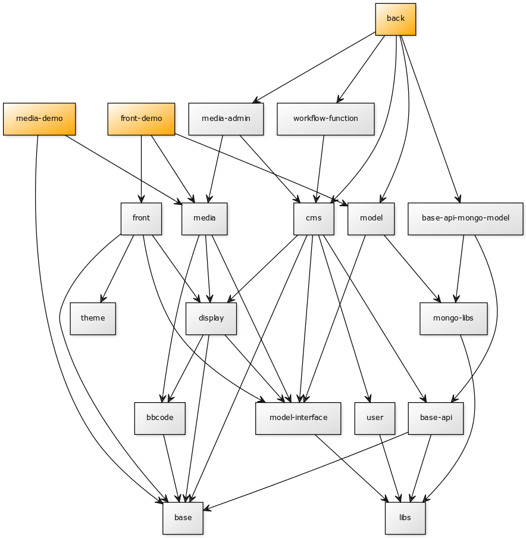

Dependancy diagram
==================

As the project evolves, we want to continuously present you all the interaction between the
Open Orchestra bundles.

Current diagram
---------------

We will provide the list of all the bundles and the relations between them in a format usable
on the `yuml.me`_ website.

.. code-block:: none

    [back{bg:orange}]->[cms]
    [back]->[workflow-function]
    [back]->[media-admin]
    [back]->[model]
    [back]->[base-api-mongo-model]
    [cms]->[base]
    [cms]->[base-api]
    [cms]->[display]
    [cms]->[user]
    [cms]->[model-interface]
    [base-api]->[base]
    [base-api]->[libs]
    [base-api-mongo-model]->[base-api]
    [base-api-mongo-model]->[mongo-libs]
    [mongo-libs]->[libs]
    [display]->[model-interface]
    [display]->[base]
    [media-admin]->[cms]
    [media-admin]->[media]
    [media]->[model-interface]
    [media]->[display]
    [model]->[model-interface]
    [model-interface]->[libs]
    [model]->[mongo-libs]
    [user]->[libs]
    [workflow-function]->[cms]
    [display]->[bbcode]
    [media]->[bbcode]
    [bbcode]->[base]

    [front-demo{bg:orange}]->[front]
    [front-demo]->[media]
    [front-demo]->[model]
    [front]->[base]
    [front]->[display]
    [front]->[model-interface]
    [front]->[theme]

    [media-demo{bg:orange}]->[media]
    [media-demo]->[base]

Diagram history
---------------

20 octobre 2015
~~~~~~~~~~~~~~~

.. _`yuml.me`: http://yuml.me
