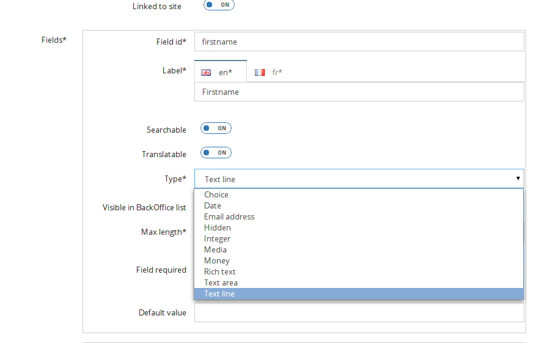

Field type
==========

Open Orchestra offers the possibility to create the Content Types from the back office.
Further information about it is available in the `Content Types documentation`_.

When creating a content type, you can add several attributes of different types.
By default Open Orchestra offers few types
(text line, date, email, hidden, integer, choice, media, money, rich test, text area).

These page explains how to create new field types to extend the possibilities.

Add a field type
----------------
To add a new field type, you need to add an entry to the configuration ``open_orchestra_backoffice.field_types``
which describes your field type.

The description of your field type must contain these values:

* ``name`` name of your field type
* ``type`` form type of your field, this can be a form type natively available in Symfony or a custom form type
* ``label`` translation key of label
* ``default_value`` (optional) describes the field allowing to contribute the default value of your field.
* ``options`` (optional) describes the different options to configure your field type (max length, required, etc).

Example of simple field type:

.. code-block:: yaml

    open_orchestra_backoffice.field_types:
        custom_textarea:
            label: open_orchestra.form.field_type.textarea
            type: textarea

Field type options
------------------

The field type can be configured with options, for instance you can add an option
to field ``custom_textarea`` to configure the max length.

You must add an entry in configuration ``open_orchestra_backoffice.options`` with 4 parameters:

* ``name`` name of option
* ``type`` form type of option, this can be a form type natively available in Symfony or your custom form type
* ``label`` translation key of label
* ``required`` a boolean indicating if option is required

When the user adds a field type at a content type, if an option of this field type is required then
the user can't save the content type until he has contributed the option.

Example of option ``max length``:

.. code-block:: yaml

    open_orchestra_backoffice.options:
        max_length:
            type: integer
            label: open_orchestra_backoffice.form.orchestra_fields.max_length
            required: true

Now, you can add the option in your field type:

.. code-block:: yaml

    custom_textarea:
        label: open_orchestra.form.field_type.textarea
        type: textarea
        options:
            max_length:
                default_value: 100

The parameter ``default_value`` is required in all options .

Open Orchestra already offers many options (max_length, required, grouping, rounding_mode, multiple, expanded
choices, currency, precision, format, widget, input) that you can use in your field type.

Field type default value
------------------------

When adding an attribute to a content type, the user may contribute the default value for this attribute.
As the default value type depends on the field type (datetime, text area, media, etc),
it is interesting to personalize the default value form.

For instance it is interesting to have a text area to contribute
the default value of your field ``custom_textarea`` created above.

.. code-block:: yaml

    textarea:
        label: open_orchestra_backoffice.form.field_type.custom_type.textarea
        type: textarea
        default_value:
            type: textarea
            options:
                label: open_orchestra_backoffice.form.field_type.default_value
                required: false
        options:
            max_length:
                default_value: 100

The ``textarea.default_value.options`` key are options proposed by Symfony for
the textarea form type (max length, label, trim, disabled, etc).

.. _`Content Types documentation`: ../user_guide/content_type.html
