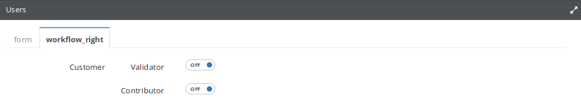

Add panel to an administration view
===================================

Context
-------

Sometimes you need to add your own forms to the existing ones in the Administration Back office to add some options to the administration items.
To answer this need; Open Orchestra implements a system to easily add tabs with your own forms in the administration edit pages.

Panel System
~~~~~~~~~~~~

Each administration facade has a list of links used by ajax to load their forms.
To display a new panel, add a link to the facade, prefixed by ``_self_panel``.

.. code-block:: php

    $linkName = "_self_panel_" + $position + "_" + $panelTitle;
    $facade->addLink($linkName, $route);

The link name is a key to find the link later.
Open Orchestra also uses this key to configure your panel:

- Add a number after "_self_panel" prefixed by "_" to choose the position of your tab (begin with 1 because ``_self_form`` link will always be in position 0)
- Add the title of your panel after the position prefixed by "_" to choose the tab name

Example
~~~~~~~

Here is an example of how the panel is used to add a workflow form to Users page.

To add this link, you can use an event subscriber on the UserFacadeEvents::POST_USER_TRANSFORMATION event :

.. code-block:: php

    class AddWorkFlowLinkSubscriber implements EventSubscriberInterface
    {
        protected $router;
        /**
         * @param UrlGeneratorInterface $router
         */
        public function __construct(UrlGeneratorInterface $router)
        {
            $this->router = $router;
        }
        /**
         * @param UserFacadeEvent $event
         */
        public function postUserTransformation(UserFacadeEvent $event)
        {
            $facade = $event->getUserFacade();
            $facade->addLink('_self_panel_2_workflow_right',
                $this->router->generate($workflowRouteName,
                    $workflowParams,
                    UrlGeneratorInterface::ABSOLUTE_URL));
        }
        /**
         * @return array The event names to listen to
         */
        public static function getSubscribedEvents()
        {
            return array(
                UserFacadeEvents::POST_USER_TRANSFORMATION => 'postUserTransformation',
            );
        }
    }

and register the event subscriber as a service in a configuration file :

.. code-block:: yml

    parameters:
        open_orchestra_workflow_function_admin.subscriber.add_workflow_link.class: OpenOrchestra\WorkflowFunctionAdminBundle\EventSubscriber\AddWorkFlowLinkSubscriber
    services:
        open_orchestra_workflow_function_admin.subscriber.add_workflow_link:
            class: %open_orchestra_workflow_function_admin.subscriber.add_workflow_link.class%
            arguments:
                - @router
            tags:
                - { name: kernel.event_subscriber }

