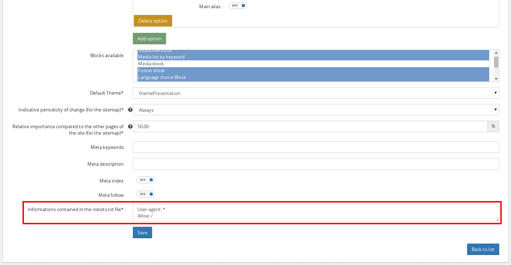

Using robots.txt
================

As Open Orchestra is a multisite platform, you will have to manage several robots.txt files for a
single installation. To simplify the maintenance of their content, they can be directly edited in
the Back Office. But contribution is only the first step. To be available, these information
require to be dumped in files and to be correctly served to the client.

Creation of ``robots.txt`` files with Open Orchestra is achieved in 3 steps:

- `files contribution`_
- `files generation`_
- `files routing`_

.. _files contribution:

Files contribution
------------------
Contributing the content of a ``robots.txt`` file is straight forward. As it is specific to each
website, you can do it in the website edit form, located in the Administration submenu. Fill the 
matching textarea: the content of the ``robots.txt`` file will be exactly what is written here.

.. _files generation:

Files generation
----------------
Once contributed, the content of the ``robots.txt`` is only known from the database. To serve it to
a client requesting it, two approaches are possible: use a controller action looking in the database
for the information matching the current site, or serve a previously generated file containing these
information.

To enhance perfomances, Open Orchestra choose the second option. This solution prevents any PHP action
and database access. As these files are static they can easily be cached by a reverse proxy.

Once a ``robots.txt`` data is contributed, you have to manually dump it into a file. Open Orchestra
provides a console command, available on your Front installation:

    app/console orchestra:robots:generate [--siteId=SITEID]

This command dumps one or all the ``robots.txt`` files depending on the siteId parameter presence.
To be accessible by web client, the generated files are stored in the web directory of your
application. Each file is stored in a sub-directory named by the site Id. For instance
if you have three sites whose id are 'site-1', 'site-2' and 'site-3', the ``robots.txt`` files will
be dumped here:

- web/site-1/robots.txt
- web/site-2/robots.txt
- web/site-3/robots.txt

A good practice is to use that command in a cron, to refresh periodically the content of the files.

.. _files routing:

Files routing
-------------
When a client requests a ``robots.txt``, it should be located at the root of the domain. But the files are
generated somewhere else, in a subfolder named by the site id. As a result, the webserver must be configured to
redirect to the matching file: this can be done by a rewrite rule . The type of
configuration to tweak depends on you server type, for instance on Apache this is done via the Virtual
Host mechanism.

Here is a configuration example for ``Apache``, in the case of a site with id 'my-site':

    <IfModule mod_rewrite.c>
        RewriteEngine On
        RewriteRule ^/robots.txt /my-site/robots.txt [L]
    </IfModule>

Once Apache is reloaded, the rewrite rule is used and the ``robots.txt`` file is accessible.

Every further modification will modify the file content but not its name, so you don't have to modify
the rewrite rule. Since then you can update the file periodically without having to restart the
webserver.