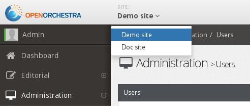

Website creation
================

Creating a new site with Open Orchestra requires four steps. Additionally, you can add some more
steps to enhance the site features. Those steps are the following:

* Declaring the website in Open Orchestra
* Dealing with access rights
* Contributing the home page
* Configuring the webserver
* (Optional) Configure the 404 & 503 pages
* (Optional) Generate the robots.txt
* (Optional) Generate the sitemap.xml

Declaring the site
------------------
The first thing to do is to declare the site in Open Orchestra by filling the website creation form.

Full details are available in the user guide, on `website creation page`_.

Dealing with access rights
--------------------------
To be able to contribute to the site, access rights have to be set. To do this, create a new group
including several roles related to this site (including ROLE_ACCESS_TREE_NODE) and assign it to the
newly created site.

Once this is done, you can add users to the group by editing them. On their next connection, these
users will be able to select that site with the site switcher. 

Further information on group contribution is available in the user guide, on `user page`_

Contributing the home page
--------------------------
To get sure the site is accessible, you should have something to see. So first thing is to select
the newly created site on the site switcher. Then, under the Editorial part of the menu, the
'Pages' entry should look like this:

.. image:: ../../images/new_site_tree.png

Clicking on 'New page' will allow you to contribute the homepage of the site. You can go to the
user guide, on the `node page`_ and `node configuration page`_ for full details about how to edit a
node.

Once contributed, publish the node (Ideally, in all the languages used by your site aliases).

Configuring the webserver
-------------------------
Now, Open Orchestra knows about your site and a first page is contributed. The last thing to do is
to get that page reachable. To do this you have to configure your webserver. The type of
configuration depends on you server type, for instance on Apache this is done via the Virtual Host
mechanism. Here is a simple example in a such context:

.. code-block: apache

    <VirtualHost *:80>
        ServerAdmin webmaster@mysite.com
        ServerName mysite.com

        DocumentRoot /absolute/path/to/Open/Orchestra/web
        <Directory /absolute/path/to/Open/Orchestra/web>
            Options -Indexes +FollowSymLinks -MultiViews
            AllowOverride All
            Order allow,deny
            allow from all
        </Directory>

        ErrorLog /absolute/path/to/logs/mysite.openorchestra.error.log
        CustomLog /absolute/path/to/logs/mysite.openorchestra.access.log combined
    </VirtualHost>

Note that the DocumentRoot must point to the web directory of Open Orchestra installation, not on
the Open Orchestra root directory.

Once Apache reloaded, your new website should be accessible.

*Note:* According to your environment, be sure to call the right front controller when testing the
access (eg app_dev.php, app_prod.php, etc ...).

(Optional) Configure the 404 & 503 pages
----------------------------------------
At this stage, your site is visible. But it's the minimum and you can add several optional features.
For instance, you can customize the 404 and 503 pages to map them to your site design. The
`documentation on error pages`_ shows how to do that.

(Optional) Generate the robots.txt
----------------------------------
Additionally, you can generate the robot.txt file according to the setting configured previously
in the website form. See `Robots.txt documentation`_ for more information about this.

(Optional) Generate the sitemap.xml
-----------------------------------
You may also want to generate the sitemap.xml of your site. To do this you can run a simple command
line. See `Sitemap.xml documentation`_ for more information about this.

.. _website creation page: /en/latest/user_guide/website_creation.html
.. _user page: /en/latest/user_guide/user.html
.. _node page: /en/latest/user_guide/node.html
.. _node configuration page: /en/latest/user_guide/node_configuration.html
.. _documentation on error pages: /en/latest/developer_guide/error_pages.html
.. _`Robots.txt documentation`: /en/latest/developer_guide/robots.html
.. _`Sitemap.xml documentation`: /en/latest/developer_guide/sitemap.html
