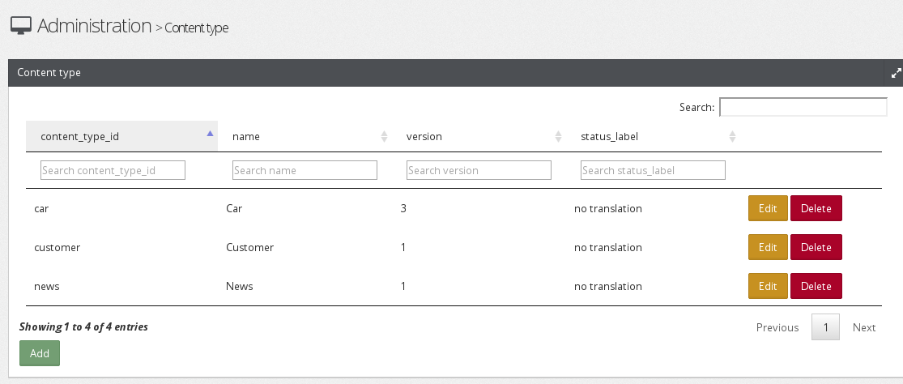
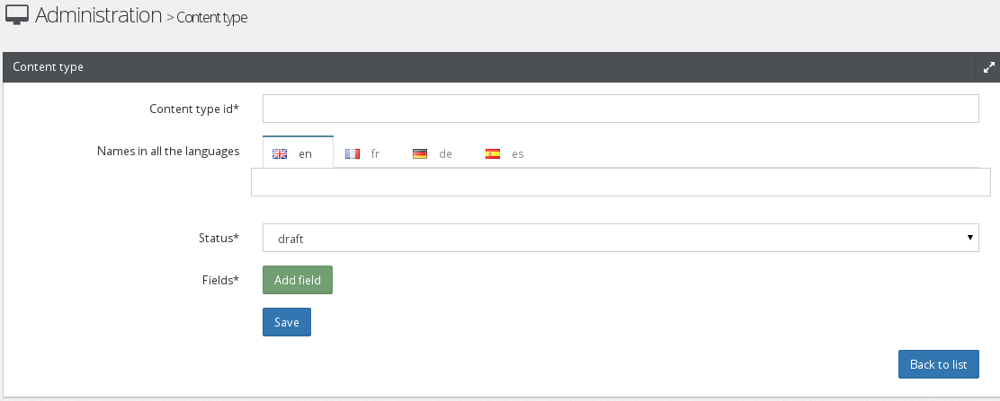
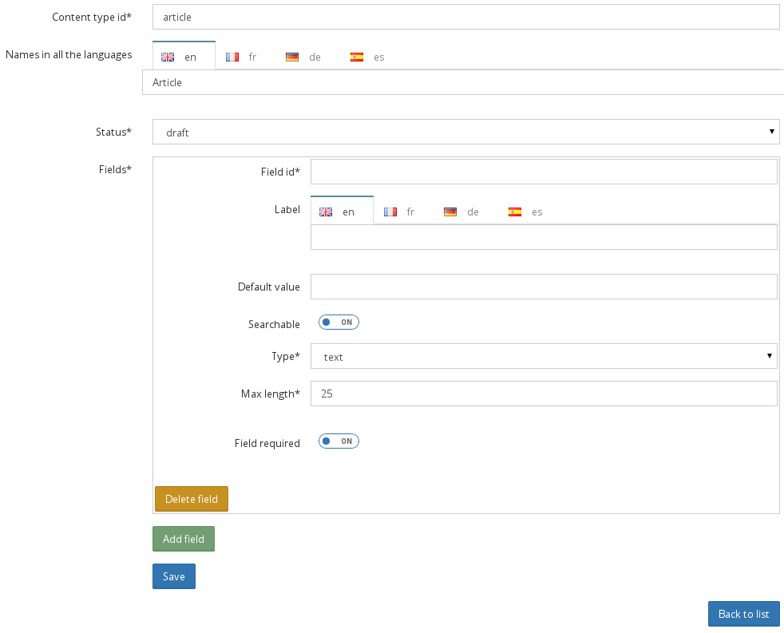

Content Types
=============

In Open Orchestra Contents are typed, which means that every content has meaning, that it belongs
to a family: an "Article" content is different from a "Customer" content. For instance, an article
requires to contribute a title, a teaser, a picture and a text, while a customer requires instead
a name, a first name, an email address and a phone number. Open Orchestra offers a RAD approach of
the Content Types that does not need to write any code for this part: from the description of the
Content Type to Content editing forms through storage in the database, everything is natively
supported.

Listing
-------

The list of existing Content Types is available in Administration part, under the Content Type entry.
This list includes a row per Content Type and indicates its internal id, its name in the language of
the Back Office, the number of the most advanced version as well as the status of this version.

Creation
--------

To create a new Content Type, from the list of Content Types, click the "Add" button. The Content Type
creation form is displayed.

In the case we want to define the Content Type "Article", we should then contribute the following fields:

* **Content Type id**: that unique identifier allows Open Orchestra to distinguish our "Article" among
others Content Type. Indicate "article"

* **Name in all the languages**: this is the name of the Content Type, displayed to contributors. It must
be translated into the different languages ​​of the Back Office. Indicate "Article" for both English and French

* **Status**: determines the status in which to create the Content Type. In our case, three status are
available: draft, pending and published. Choose "draft" for this first version.

These three fields are systematically required when creating a Content Type, and identifies it among
the others, but they do not characterize so far the "Article " Content Type. It remains to indicate
that an article includes a title, a teaser, picture and text.
This is done by individually adding each of these attributes.
To add an attribute, click the "Add field" button. A new form box appears, specific to the first
attribute, in our case the "title" of our "Article" Content Type.

* **Field id**: internal identifier, unique among all the attributes composing the Content Type. It is
through this that Open Orchestra distinguishes the title of the article from its picture for example.
Simply indicate "title"

* **Label**: the name of the attribute visible in the "Article" edit form. This label has to be translated
into every language of the Back Office. Indicate "Title" in English and "Titre" in French.

* **Default value**: The default value of this attribute in the "Article" edit form. It would not have
no sense to give a default title to our articles, so leave this field empty.

* **Searchable**: whether this attribute should be indexed by the internal search engine. For example,
it would be useful for a user of the site to find our articles by typing some part of their titles in
the search box. The titles of the articles must so be indexed, so put this value to "yes".

* **Type**: determines the type of the attribute. Is it a date, an image, a text line or a rich text block?
In our case the title is a single line of text, so we choose "text". The end of the contribution of
the attribute depends on the selected type. In the case of a "text", the maximum length allowed must be
given. To have short titles, indicate 50.

* **Field required**: last information to set the title attribute. This is to indicate whether the attribute is
required or not when creating an article. Indeed, it is important that each article has a title, so indicate
"yes"

This procedure must be repeated for each attributes characterizing the article. So you have to click again
on "Add field" to describe the "image" attribute, again for the "teaser" attribute and one for the "text"
attribute.
Once all the attributes described, a click on the "Save" button saves the "Article" Content Type. It is
then immediately possible to create articles and save them in the database.

Edition
-------

To edit an existing Content Type, from the list of Content Types, click the correct "Edit" button. The form
used when creating the Content Type is displayed again, and it is possible to change what must be.
Clicking the "Save" button will generate a new version of the Content Type, incorporating all changes.

Front display
-------------

The contents are not directly accessible in Front Office. Like everything visible in Front Office, the contents
are displayed through blocks. See the documentation on the `blocks`_ for more information about it.

.. _blocks: