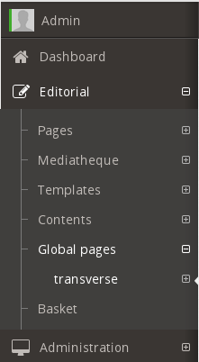
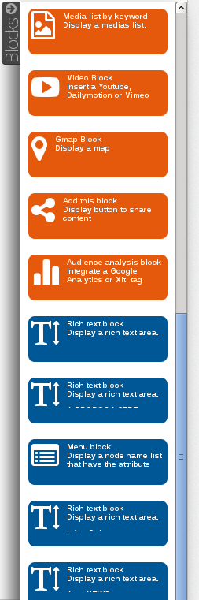

Global Pages and Blocks
=======================

On a webite, certain elements such as header and footer appear from pages to pages. On Open Orchestra
it would be a pain to contribute again and again those elements in each node. To avoid this, Open
Orchestra provide a way to contribute some part of a website once for all. This feature is delivered
by the **Global pages** and the **Global blocks** functionalities.

A "Global block" is a block contributed once and that can be include in any node. Those blocks are
contributed in a special node type that can be seen as a "Global block" repository : a "Global page".

Global pages
------------

Global pages can be accessed through the main menu of the Back Office. They have several languages,
don't have a `workflow`_ and have only one version.

Contribution of global pages works the same way as other pages (see `Node`_).

Global blocks
-------------

When contributing a node, available blocks are shown in the block panel. Global blocks that have been
contributed in global pages appear with a blue background, while standard blocks appear in orange.

Contribution of global blocks works the same way as other blocks (see `managing block in node`_),
except that they can be edited only on the node they where created in, ie their global page.

.. _`managing block in node`: /en/user_guide/node.rst#managing-blocks-in-nodes
.. _`Block creation`: /en/developer_guide/block_creation.rst
.. _`Block list`: /en/user_guide/block_list.rst
.. _`Node`: /en/user_guide/node.rst
.. _workflow: /en/user_guide/workflow.rst
