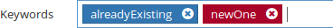

Keyword management
==================

Open Orchestra allows to attach keywords to content or media. They describe the content and allow to manage it.
In the keyword panel, you can create or destroy a keyword. If you use a NoSql database and you destroy a keyword, it will still stay in the content where it is used.

Usage
-----

When you fill the meta data for a content or media, already created keyword can be chosen from a list.
Alternatively, you can create new ones using the ``keyword`` field.

The ``content list block`` and ``media list by keyword`` provide a way to filter the contents and medias by keywords.
