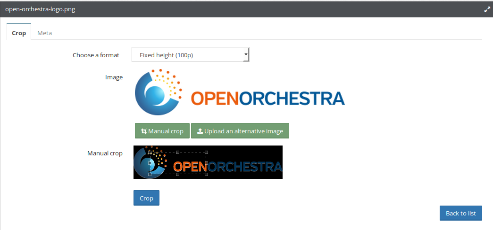

The Media Library
=================

With the media bundles (MediaAdminBundle, MediaBundle and MediaFileBundle), Open Orchestra gets a consistant media
library. This library allows you to upload media, manage them and reuse them on multiple locations of your site,
such as in blocks or contents.
Natively, images, PDF, sounds and videos are supported but it can be easily extended by a PHP developer to some
other formats.

All files uploaded by users are organised inside folders. When the media library is activated, the navigation panel
contains an entry to the media library presenting the media folders tree. You can see the content of a folder by
clicking on it.

Create a folder
---------------

To create a folder, browse the folders tree where you want to create the folder and click on the "new folder"
button. The creation form then appears and require you to fill the following fields:

* Name: the name of the folder
* Websites: the folder you are creating will be available only for the sites you select in this multiselect

Remove a folder
---------------

To remove a folder, first select the folder. The gallery displaying the content of the folder then appears. You can
remove that folder only if it is empty. If this is the case, the toolbar located on the top right hand side of the
gallery will contain a trash icon. Click on this icon to delete the folder.

Manage files
------------

To add a file, select the folder you want to store it. Then on the bottom of the gallery, click the "add button".
You can upload files in 3 different ways. The hole area is droppable, wich mean you can drag'n'drop files from your
computer to upload them. You can also use the "Select a folder from your computer" to upload all files contained in
that folder or only upload a file using the "Select a file from your computer" button. All files matching the types
allowed in configuration, will be uploaded.

Returning on the gallery, you should see your media.

Putting your cursor over the preview makes a panel appear. This panel allows you to delete the media. Note that the
media can not be deleted if it is used in a published element (block or content).

Clicking on the media preview opens a page to administrate the meta information of the media. If the media is an
image, you can also alter some generated version.

Meta informations
~~~~~~~~~~~~~~~~~

You can administrate the following meta informations:

* Title: the title of the media in different languages
* Alt: the description of the media in different languages. It is used by the visitors browsers, especially for
  blinded monitor.
* Media's copyright: the copyright on the media
* Comment: A comment on the media
* Keyword: By tagging media, you can for instance regroup them with a common tag in a block

Image alternatives
~~~~~~~~~~~~~~~~~~

When you upload an image, several alternatives in different sizes are automatically generated to improve the
rendering in the front office. According to the context the image could be displayed as a thumbnail or as a big
poster. Out of the box, Open Orchestra generat three differents alternatives:

* Fixed height: Adapt height and keep proportion
* Fixed width: Adapt width and keep proportion
* Rectangle: Reduce to fit in the rectangle format, keeping the proportion

These ones can be personalized on a custom installation.

But you may want to alter an automatically generated alternative with an image more specific. You have two ways
of doing that: crop manually the original image or upload a totally different alternative.

First thing to do this is to select the alternative you want to update. Then choose between:

* Manual crop: This will display the original image. You can select the part you want to keep. By saving your
  selection, Open Orchestra will resize it to fit the alternative format.
* Upload an alternative image: Simply upload a new image and it will replace the automatically generated version.

