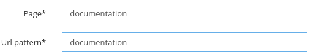
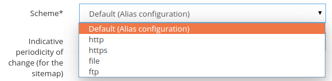
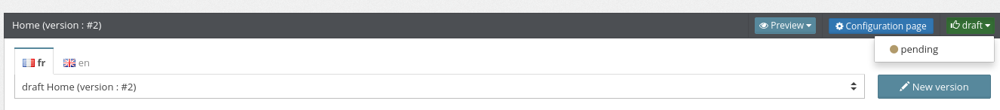
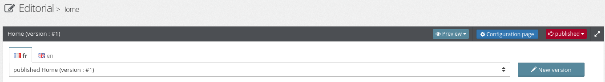
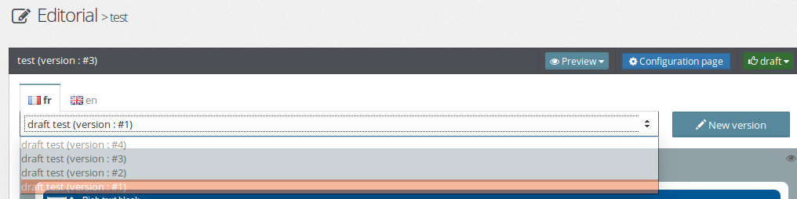
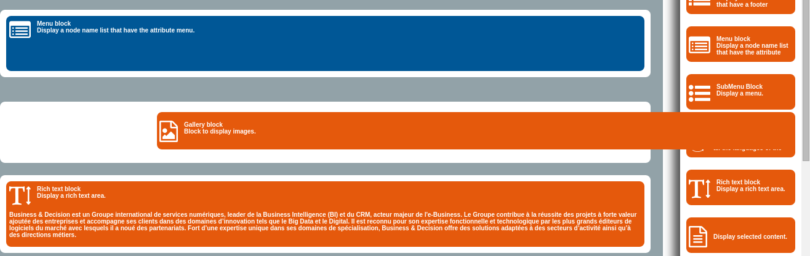

Node
====

Nodes are mainly pages that the visitors can see on the website, they are containers for zones and `blocks`_.
The nodes are multilingual, versioned and have a validation workflow.

Node creation and Basic configuration
-------------------------------------

Contribute the name of the page and  then chose an url pattern, it informs the url pattern which will allow to see this page on the site.
The pattern can be also built automatically when the name of the page is contributed.

Choose a scheme for the page, to define how the page will be accessible (http, https, etc...).
By default Open Orchestra takes the protocol informed in the site configuration.

Choose a theme to dress the page in Front Office.

During the creation of a node choose a template to create the structure of the page with preconfigured areas.
This node can also copy an existing node.

See also `node configuration`_.

Languages
---------

A node has several languages defined during the configuration of the Back Office.
The node language being edited can be changed by clicking on the language tab. If this node has no data for this language, it will be created.

Workflow
--------

Nodes have a status and can have a validation workflow, which is the series of steps to achieve for publication of a node before it can be displayed on Front Office.
Status of a node is linked to language of this one.
Node have an initial status for this creation and to be able to display on Front Office the node has to have a final status.

To know more about status see also `workflow`_.

Versionning
-----------

A node have several versions.
The node version is linked to language of this one.
To create a new version of a node click on the "new version" button.

The latest version of the node is duplicated and the node is set to the initial status.

Then find all the versions of a node in the drop-down list.

The latest version of the node in the final status will be the one displayed in Front Office.

Managing blocks in nodes
------------------------

Open Orchestra allows to add blocks in nodes.
The visible list of blocks during the edition of a node is defined inside the site configuration.

See also `node configuration`_ and `site configuration`_.

Nodes can use default blocks and global blocks.
Those blocks have different colors.
The global ones are editable only in the global node.

See also `node and block transverse`_.

On the right appears the list of blocks, which is visible only if the node is alterable (not in the final status).

.. image:: ../../images/block_panel.png

See also `block list`_.

Drag and Drop
~~~~~~~~~~~~~

Open Orchestra allows to add or to move blocks in a node using drag and drop.
To add a new block in a node open the block panel to display the list of blocks and drag a block in node's area.
At the top of the list of blocks there are the new blocks and below transverse blocks.

If the mouse hovers a block, a toolbar will be displayed.
When the node is alterable the toolbar contains a cursor, the block title, a pen and a trash can.
To move a block in a node select the cursor and make it slide towards another area.
To delete a block click on the trash can and to edit the block configuration click on the pen.
The pen is visible only if the block is not a transverse block.

.. image:: ../../images/block_toolbar.png

When the node is not alterable the toolbar contains only the block title and an eye to see the block configuration.
The eye is visible only if the block is not a transverse block.

.. _workflow:
.. _node configuration: /en/latest/user_guide/node_configuration.rst
.. _site configuration: /en/latest/user_guide/websites_creation.rst
.. _node and block transverse:
.. _block list: /en/latest/user_guide/block_list.rst
.. _blocks: /en/latest/key_concepts.rst#blocks
