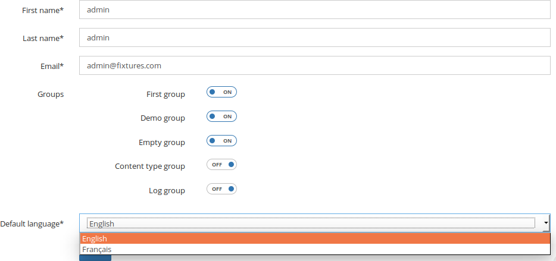
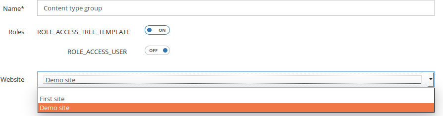

User, Role and Group
====================

Open Orchestra offers the possibility to manage users with different rights.

User Management
---------------

The users page allows to search, create, edit and delete users.

At the creation, some fields are required :

* **first Name**
* **last Name**
* **e-mail**
* **username**
* **password**

Once the user is created, you can add his default language and some groups.

Role Management
---------------

A role gives one type of authorization for a user.

Roles contain:

* **name**
* **descriptions**: describe role in every languages
* **original/destination status**: optional parameters to define a `workflow`_.

Some `roles are already created in the fixture`_.

Group Management
----------------

Each group has a name, a list of roles and is associated to only one website.
Users in a group inherit rights defined in this group for the associated website.
Using group is the recommended way to give users some rights.

.. _workflow: /en/user_guide/workflow.rst
.. _`roles are already created in the fixture`: /en/user_guide/role.rst