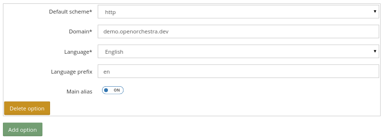
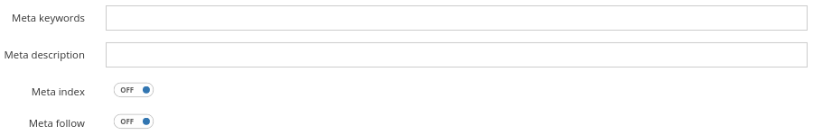

Website creation
================

Open Orchestra is multisite and allows to create several websites from the same Back Office application.

So, the first first thing to do to create a new site is to go to the Back Office and fill the
website creation form found under the Administration entry of the navigation menu.
These documentation helps you to fill that form.

Name (required)
---------------

The name field is the website name and is used to generate the website identifier.

Website id (required)
---------------------
.. image:: ../../images/website_id.png

The website id can be generated by Open Orchestra from the site name or filled by the user when
creating the site.
Once the site created, this field is no more editable.
Open Orchestra verifies during the form validation that the site id does not already exist as it
must be unique among all the sites.

Aliases
-------

A site may exist in different languages, and each of this versions could have minor differences, for
instance a node could be published in English and not in French. Moreover, a site in English could be
accessed from different domains. To make the management of those problematics easier, Open Orchestra
introduces the concept of site alias.
Basically a site represents a set of site aliases sharing contents and pages, each site alias in a
single language. Multiple site aliases can be configured with the same language, if they define
different access points, eg domain + language prefix.

For instance, the site http://demo.open-orchestra.com/ exists in english and french. It presents two
site aliases:

* Scheme by default (required): http
* Domain (required): demo.openorchestra.com
* Language (required): English
* Language prefix : en
* main aliases : on

* Scheme by default (required): http
* Domain (required): demo.openorchestra.com
* Language (required): French
* Language prefix :
* main aliases : off

The website home page for english version is ``http://demo.openorchestra.com/en`` and
``http://demo.openorchestra.com`` for the french version.

See the `routing documentation`_ for further information.

Blocks available
----------------
.. image:: ../../images/blocks_available.png

This field lists all the blocks available to nodes contribution for this website.
Only the selected blocks will be available.

Default Theme (required)
------------------------

The field theme is the default theme used by the website.
This setting can be overridden node by node in order to have a specific theme on a special node.

Sitemap generation (required)
-----------------------------

The two following settings are related to the sitemap.xml generation. Those settings are used as
default values for all nodes of the site, but they can be overridden node by node.

* Indicative periodicity of change of the page
* Relative importance compared to the other pages of the website

Meta
----

The meta attributes are set in the HTML header of a web page to provide information about the nature
and content of the page.
The settings contributed here are default values for each node of the site, but can be overridden
node by node.

Meta keyword
~~~~~~~~~~~~

This is a list of keywords asociated to the page and can be used by search engines for ranking.

Meta description
~~~~~~~~~~~~~~~~

This is used by search engines to display a description of the page in the results list.

Meta index
~~~~~~~~~~

This attribute defines whether or not the page should be referenced in search engines.

Meta follow
~~~~~~~~~~~

This attribute indicates to search engines if they should follow hypertext links encountered in
the page to index linked documents.

Informations contained in the robots.txt file (required)
--------------------------------------------------------

This field contains the data of the robots.txt file.

robots.txt file example
~~~~~~~~~~~~~~~~~~~~~~~

    User-agent: *
    Allow: /

User-agent: * means that one or several instruction (s) which follow applies for all the agents.
Allow: / means that the search engine can browse all the directories and the pages of the site.

.. _routing documentation: /en/developer_guide/routing.rst
