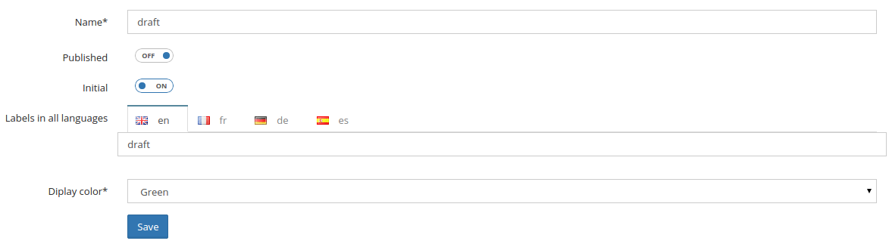
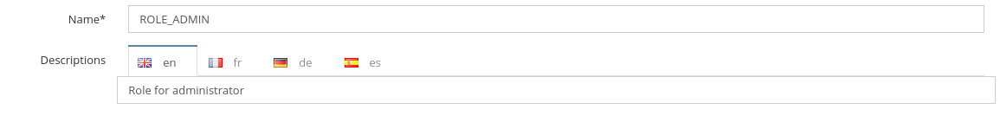
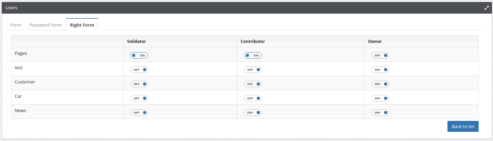

Workflow
========

In Open Orchestra, key contributions such as nodes and contents are subject to a publication workflow.
It allows several levels of validation by different people from creation to publication. Workflow
are fully customizable.

A workflow is composed of steps, each corresponding to a status.
Each status could be linked to an other by a transition called 'Role'.
These roles are grouped in collections called 'Workflow Function'.
Finally, in user's administration, it is possible to add a workflow function to a user on a given content type or on nodes.

For instance :
    - three statuses : ``draft``, ``pending`` and ``published``
    - two roles : ``DRAFT_TO_PUBLISHED`` (transition ``draft`` to ``published``), ``PENDING_TO_PUBLISHED`` (transition ``pending`` to ``published``)
    - one workflow function: ``Validator`` (containing ``DRAFT_TO_PUBLISHED`` and ``PENDING_TO_PUBLISHED``)
    - a user with ``Validator`` function on ``News`` (content type)

There are two kinds of roles, those creating a link between a ``from`` and a ``to status`` and those without this statuses links.
The first type defines workflow roles, the only type which could be used in workflow function.
The second one defines access roles used to grant access or not to Back Office features. They are used in group context.

When adding a workflow function to a user on a particular content type or on the nodes, it is possible to choose
if this function is activated only for the contributions of this user or for all contributions by checking ``owned``.

Status
------

Each version of a node or a content has a status representing its state (for instance draft or
published).
There are 3 types of status : 

* An **initial** status is the beginning state of a workflow (automatically assigned to a node or a
  content just after its creation).
* A **final** status makes a content visible on the Front Office.
* All status that are not initial or final are **standard**

An administrator can define as many status as required to create his workflow.

Status creation
~~~~~~~~~~~~~~~

The status form asks for the following information:

* **Name** (required): status name
* **Published**: if this status is final
* **Initial**: if this status is initial
* **Label**: status label in all available languages in Back Office
* **Color** (required): color representing the status (used on the node or content edit page)

Roles
-----

The role form asks for the following information:

* **Name**: role name
* **Description**: role description in all available languages in Back Office.
* **Status from**: as roles are transitions between two statuses, source status for the role
* **Status destination**: as roles are transitions between two statuses, destination status for the role

The selection of two statuses in the role form will define a workflow role.

.. image:: ../../images/role_transition.png

This role creates a transition between Draft status and Pending status. So users with this role will
be able to change the status of a node or content from Draft to Pending. They will do this via a small
widget on the node or content edit page.

.. image:: ../../images/status_transition.png

If no status is selected, the role will define an access role. See also `group management`_

Workflow Function
-----------------

The workflow function form asks for the following information:

* **Name**: workflow function name in all available languages in Back Office.
* **Role**: a list of all roles with a from and destination status, multiple selection allowed.

.. image:: ../../images/workflow_function_form.png

Workflow Rights
-----------------

A double entry table asks for each content type or nodes and for each workflow function, if the selected user get this right.
The last column indicates whether that right concerns only the contributions of this user or all contributions of this kind.

.. _group management: /en/latest/user_guide/user.html
